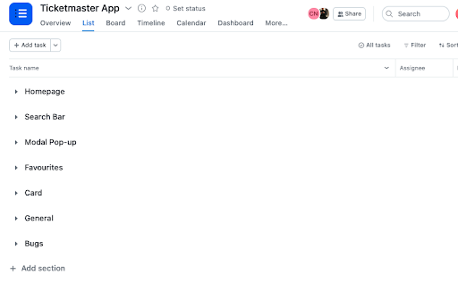
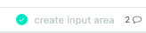
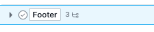
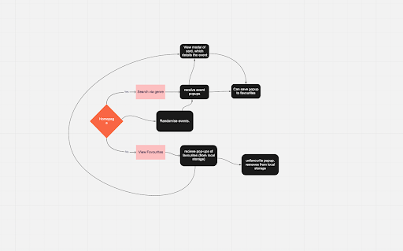
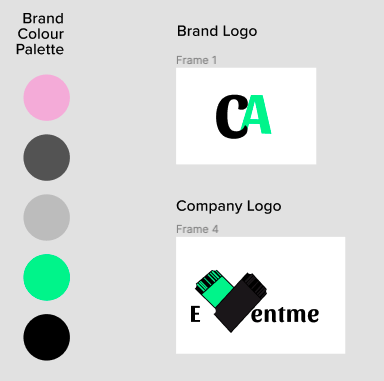
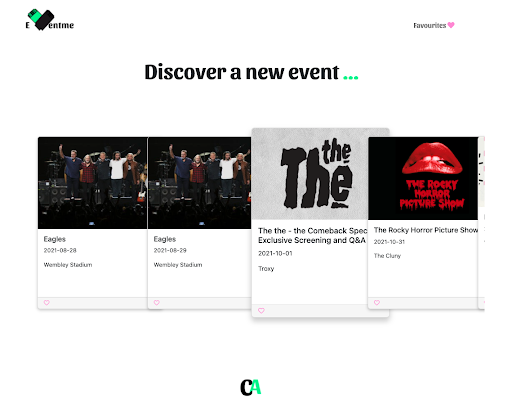
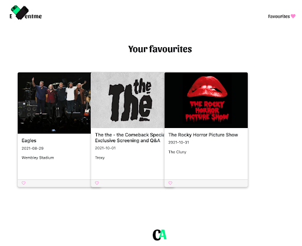
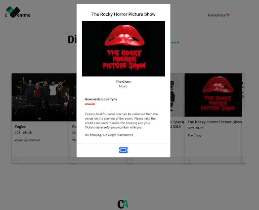

# Eventme

<h2>Overview </h2>

Eventme is a website that supports people to get back into the live music scene in London. On this website the user can find live music inspiration, favourite the ones they like and be redirected to the webpage of where the tickets are sold. This second project was a React pair-coded project with Arjun Doel and was done in the style of a 48-hour hackathon. 

Access the website [here](https://event-me.netlify.app/) and the repo [here](https://github.com/CNMABC/event-finder)

.gif)

<h2> Brief </h2>
<ul>
<li>Create a React App consuming a public API.</li>
<li>Enable the app to have a router with several pages.</li>
<li>Deploy online which can be accessed by the public. </li>
<li>Design wireframes before starting to code. </li>
</ul>
  
<h2>Technologies Used </h2>
<h3> Front-end</h3>
<ul>
<li>React</li>
<li>JSX</li>
<li>Axios</li>
<li>React Bootstrap</li>
<li>Bulma</li>
<li>SCSS</li>
<li>React Router Dom </li> 
<li>DOM storage</li>
</ul>

<h3>Api Used :  </h3>

[Ticketmaster API](https://developer.ticketmaster.com/products-and-docs/apis/getting-started)


<h3>Dev tools : </h3>
<ul>
<li>VS code</li>
<li>Yarn</li>
<li>Insomnia</li>
<li>Git & GitHub</li>
<li> Google Chrome dev tools</li>
<li>Figma (Wireframing)</li>
<li>Miro (user journey mapping)</li>
<li>Netlify(deployment)</li>
</ul>

<h2>Approach & Planning Process</h2>
As it was a pair-coded project we decided to break-up our planning according to the page or feature so we could track the detailed development of each element. According to the ticket of that task, we would add comments to it so the other person understood the stage they had left the code in. Also if that task needed to be broken down we then added sub-tasks to be completed. 



Here is an example of a ticket with 2 comments on.



  
Here is an example of a ticket with 3 sub-tasks.
  


We then went through the design process starting with user need statements, user personas, user flow, wireframes and then creation of the first MVP. Our user was a young music lover who was missing live music over the lockdown period and wanted inspiration about what was happening in and around London. They wanted something quick, trendy and easy to access which would direct them to be able to book tickets if they liked the look of the event. 

This is our user flow starting the user from the homepage and mapping out the different journeys they could go on. 


  
Figma (below) style guide created by me.
  

  
This is the initial homepage that users are greeted with. Users were then able to click on the heart at the bottom of the card which would then fill up and be saved through DOM storage into the favourites page. 
  


  
Once an image is clicked in the carousel on the homepage a modal pops up, the background screen goes grey and you are presented with information about the event. By clicking on the ticket button at the bottom you are then redirected to the url to purchase your ticket. 
  

  
<h2>Wins</h2> 

On the homepage I coded the navigation bar, and footer and designed all the branding including logos, colour scheme etc. which I was really happy with. We pair-coded all the axios requests and were able to pull through all the deeply nested pieces of information that we needed.  At the beginning of the project I was not very comfortable with refactoring but by the end I began to love it. 

 <h2>Challenges</h2>

The ticketmaster API was very large and it took us a while to make sure we had the correct key, the correct API as they are worldwide and then the correct city. With such little time, we were delayed by burying deep for the nested information and pulling that through the axios but we worked it out and then used the map method to show all the shows. Storing favourites in the local storage was difficult to start with and we both worked on this problem together to cure the issues as we needed to make sure that the stored ids did not disappear when the page was reloaded. 

  ``` javascript
  
  const CardComp = ( { image, id, name, venue, date, showModal, localStorageItem, setLocalStorageItem } ) => {
 const [heart, setHeart] = useState(false)
 
 const saveEventIDToLocalStorage = e => {
   setHeart(true)
   const newLocalStorageItems = [...localStorageItem, e.target.id]
   console.log('new', newLocalStorageItems)
   setLocalStorageItem(newLocalStorageItems)
   localStorage.setItem('EventID', JSON.stringify(newLocalStorageItems))
   getItem()
 }
 
 const getItem = () => {
   const item = localStorage.getItem('EventID')
   console.log('ITEM', JSON.parse(item))
 }

  ```
For the favourites page we had to make another axios request to only pull through the events that were favourited .

  ``` javascript
  
  useEffect(() => {
   console.log(getItem())
   const getData = async () => {
     const apiKey = 'gCK1UZiAtKeL5bTCeol9GN91BXQYtQFa'
     const { data } = await axios.get(`https://app.ticketmaster.com/discovery/v2/events.json?classificationName=music&countryCode=GB&apikey=${apiKey}`)
     const apiArray = data._embedded.events
     const comparison = apiArray.filter(ite => getItem().includes(ite.id))
     // setEvents(apiArray.filter(ite => idsFromLocalStorage.includes(ite.id)))
     setEvents(comparison)
   }
   getData()
 }, [])

  
  ```
  
 <h2>Bugs</h2> 
  
On some cards within the carousel it freezes if you pick it and the modal does not pop up. On some computers the scrolling bar for the carousel would show whilst on others it wouldn’t. 

<h2>Future Improvements</h2> 
<ul>
<li> Fix all the above bugs.</li>
<li>Enable categories of music to be shows.</li>
<li> Create a search bar so the user can quickly look for the band or venus that they desire.</li> 
</ul>

<h2>Key Learnings</h2> 

Pair-coding with someone else for the same time is really interesting as you need to ensure you are going at the correct pace otherwise code could get lost, you get confused or you don’t create a good teamwork environment. I started to understand the importance of Googling things as a developer and teaching myself that it is not teaching but makes you improve. 

  
  
